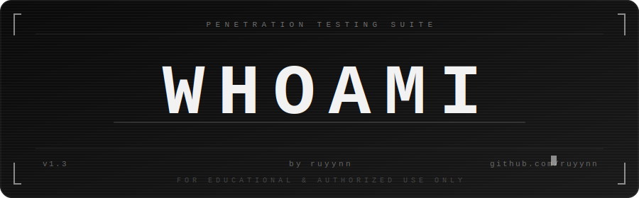

<div align="center">
  
</div>

<div align="center">

[](https://python.org)
[](https://github.com/ruyynn/whoami)
[](LICENSE)
[](https://github.com/ruyynn/whoami)
[](https://github.com/ruyynn/whoami/forks)
[](https://github.com/ruyynn/whoami/issues)

[](https://github.com/ruyynn)
[](https://github.com/ruyynn)
[](https://github.com/ruyynn)
[](https://github.com/ruyynn)

[](https://github.com/ruyynn/whoami)
[](https://github.com/ruyynn/whoami)
[](https://github.com/ruyynn/whoami)
[](https://github.com/ruyynn/whoami/issues)
[](https://saweria.co/Ruyynn)

</div>

---

## ⚠️ Disclaimer

**whoami** is developed strictly for **educational purposes** and **authorized penetration testing** only.

- You **must have explicit written permission** from the system owner before using this tool against any target.
- Using this tool against systems, networks, or devices **without authorization is illegal** and may violate laws including the Computer Fraud and Abuse Act (CFAA), the EU Directive on Attacks Against Information Systems, and equivalent laws in your country.
- The author (**ruyynn**) takes **absolutely no responsibility** for any damage, data loss, legal consequences, or misuse arising from the use of this tool.
- This tool is provided **"as is"** without warranty of any kind.
- **You are solely and fully responsible for your own actions.**

By downloading or using whoami, you agree to these terms.

---

## About

**whoami** is a multi-platform, all-in-one penetration testing suite written in Python. Built with simplicity and functionality in mind, it brings together the most commonly used tools in a single, easy-to-navigate terminal interface — no complex setup, no scattered scripts.

Whether you're a security researcher conducting authorized audits, a student learning the fundamentals of ethical hacking, or a developer testing your own infrastructure, whoami provides a practical and accessible starting point. It runs natively across Termux (Android), Linux, Windows, and macOS, making it flexible enough for both field and lab environments.

The project is still actively developed, with more advanced modules planned for v2.0.

---

## Features

| Category | Tools |
|----------|-------|
| Information Gathering | Whois Lookup, DNS Enumeration, Subdomain Finder, HTTP Header Grabber, IP Geolocation |
| Network Scanning | Port Scanner, ARP Scanner, Ping Sweep, Traceroute |
| Vulnerability Scanner | SQL Injection Scanner, XSS Scanner |
| Web Application Testing | HTTP Header Grabber, SQLi, XSS |
| Password Attacks | FTP Bruteforce, SSH Bruteforce, Telnet Bruteforce, HTTP Bruteforce, MD5 Hash Cracker |
| Wireless Attacks | *(Coming in v2.0)* |
| Post Exploitation | *(Coming in v2.0)* |
| Reporting | *(Coming in v2.0)* |

---

## Supported Platforms

- Termux (Android)
- Linux (Ubuntu / Debian / Kali / Arch)
- Windows (10/11)
- macOS

---

## Installation

### Linux / macOS
```bash
git clone https://github.com/ruyynn/whoami
cd whoami
pip install -r requirements.txt
python3 whoami.py
```

### Termux (Android)
```bash
pkg update && pkg upgrade
pkg install python git
git clone https://github.com/ruyynn/whoami
cd whoami
pip install -r requirements.txt
python whoami.py
```

### Windows
```bash
git clone https://github.com/ruyynn/whoami
cd whoami
pip install -r requirements.txt
python whoami.py
```

---

## Usage

```bash
python3 whoami.py
```

Once launched, select your platform and navigate through the interactive menu.

---

## Preview

<!-- Replace 'assets/preview.png' with your actual screenshot path after uploading to the repo -->
<div align="center">
  
</div>

---

## Roadmap

- [x] v1.0 — Initial release
- [x] v1.3 — Multi-platform support, bruteforce modules, vuln scanner
- [ ] v2.0 — Wireless attacks, post exploitation, reporting (PDF/JSON/HTML), improved scanner payloads

---

## Author

**ruyynn**

- GitHub: [github.com/ruyynn](https://github.com/ruyynn)
- Gmail: [ruyynn25@gmail.com](mailto:ruyynn25@gmail.com)
- Facebook: [Facebook](https://facebook.com)

---

## Contributing

All contributions are welcome, no matter how small. Here's how you can help:

- Star this repo
- Fork and develop new features
- Report bugs via [GitHub Issues](https://github.com/ruyynn/whoami/issues)
- Request features through Issues
- Contact directly via Gmail or Facebook above

Every contribution means a lot to the continued development of whoami.

---

## Bug Reports & Questions

Found a bug or have a question? Reach out via:

| Platform | Link |
|----------|------|
| GitHub Issues | [Open an Issue](https://github.com/ruyynn/whoami/issues) |
| Gmail | [ruyynn25@gmail.com](mailto:ruyynn25@gmail.com) |
| Facebook | [Facebook](https://facebook.com) |

---

## Support Development

If this tool has been useful and you'd like to support the development of **whoami v2.0**, donations are available via Saweria:

<p align="center">
  <a href="https://saweria.co/Ruyynn">
    
  </a>
</p>

Donations are never required, but always appreciated.

---

<div align="center">
  <b>whoami v1.3 — by ruyynn</b><br>
  <i>v2.0 coming soon</i><br><br>
  If this tool has been helpful, a ⭐ star goes a long way.
</div>
